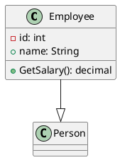
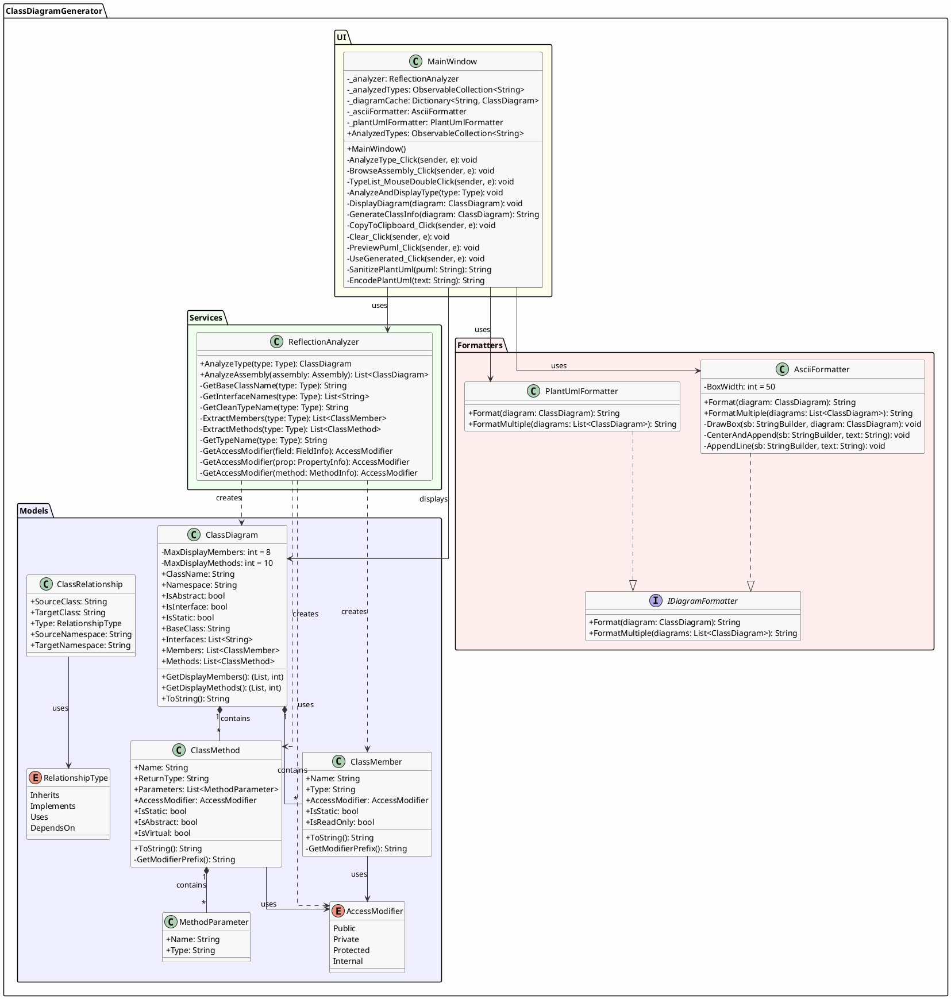

# Документація проєкту "Class Diagram Generator"

## 2. Обґрунтування проєктного рішення

### 2.1 Постановка задачі

Розробити програмний застосунок для автоматичної генерації UML-діаграм класів на основі аналізу .NET збірок (assemblies) та типів з використанням механізму рефлексії (Reflection).

### 2.2 Аналіз можливих варіантів рішення

#### Варіант 1: Консольний застосунок
**Переваги:**
- Простота реалізації
- Мінімальні залежності
- Швидкий запуск

**Недоліки:**
- Відсутність візуального інтерфейсу
- Незручність для кінцевого користувача
- Обмежені можливості взаємодії

#### Варіант 2: WPF Desktop застосунок (обраний варіант)
**Переваги:**
- Зручний графічний інтерфейс
- Можливість перегляду результатів у різних форматах
- Інтерактивна робота з даними
- Вбудований попередній перегляд PlantUML
- Нативна підтримка Windows

**Недоліки:**
- Залежність від Windows
- Більший розмір застосунку

#### Варіант 3: Web-застосунок (Blazor/ASP.NET)
**Переваги:**
- Кросплатформеність
- Доступ через браузер

**Недоліки:**
- Складніша архітектура
- Потребує серверної інфраструктури
- Обмеження безпеки при завантаженні збірок

### 2.3 Обґрунтування обраного рішення

Обрано **WPF Desktop застосунок** через:

1. **Цільова аудиторія** - розробники .NET, які працюють переважно на Windows
2. **Безпека** - локальне виконання дозволяє безпечно аналізувати будь-які збірки
3. **Продуктивність** - пряма робота з файловою системою без мережевих затримок
4. **Функціональність** - можливість інтеграції з PlantUML сервером для візуалізації
5. **Зручність** - багатовкладковий інтерфейс для різних форматів виводу

### 2.4 Обрані технології

| Компонент | Технологія | Обґрунтування |
|-----------|------------|---------------|
| Платформа | .NET 8.0 | Сучасна LTS версія з високою продуктивністю |
| UI Framework | WPF | Потужний фреймворк для Windows Desktop |
| Аналіз типів | System.Reflection | Стандартний механізм .NET для рефлексії |
| Візуалізація | PlantUML Server | Безкоштовний онлайн-сервіс для рендерингу діаграм |
| Архітектура | MVVM-like | Розділення логіки та представлення |

---

## 3. Пояснювальна записка

### 3.1 Теоретичні положення

#### 3.1.1 UML-діаграми класів

**UML (Unified Modeling Language)** — це стандартизована мова візуального моделювання, яка використовується для специфікації, візуалізації та документування програмних систем.

**Діаграма класів** відображає:
- Класи та їх атрибути (поля, властивості)
- Методи класів з параметрами та типами повернення
- Зв'язки між класами (наслідування, реалізація інтерфейсів)
- Модифікатори доступу

**Нотація модифікаторів доступу в UML:**
- `+` — public (публічний)
- `-` — private (приватний)
- `#` — protected (захищений)
- `~` — internal (внутрішній)

#### 3.1.2 Механізм рефлексії в .NET

**Рефлексія (Reflection)** — це механізм, який дозволяє програмі досліджувати метадані про типи під час виконання.

Основні можливості:
- Отримання інформації про збірки (Assembly)
- Аналіз типів (Type)
- Отримання членів класу (FieldInfo, PropertyInfo, MethodInfo)
- Визначення модифікаторів доступу та атрибутів

```csharp
// Приклад використання рефлексії
Type type = typeof(MyClass);
FieldInfo[] fields = type.GetFields(BindingFlags.Public | BindingFlags.NonPublic);
MethodInfo[] methods = type.GetMethods();
```

#### 3.1.3 Формат PlantUML

**PlantUML** — це інструмент з відкритим кодом для створення UML-діаграм з текстового опису.

Приклад синтаксису:


### 3.2 Опис реалізації проєкту

#### 3.2.1 Архітектура системи

Проєкт побудований за принципом **розділення відповідальностей (Separation of Concerns)**:

```
┌─────────────────────────────────────────────────────────────┐
│                    Presentation Layer                       │
│                    (MainWindow.xaml)                        │
├─────────────────────────────────────────────────────────────┤
│                    Business Logic Layer                     │
│  ┌─────────────────────┐    ┌──────────────────────────┐    │
│  │ ReflectionAnalyzer  │    │    DiagramFormatter      │    │
│  │   (Services/)       │    │    (Formatters/)         │    │
│  └─────────────────────┘    └──────────────────────────┘    │
├─────────────────────────────────────────────────────────────┤
│                      Data Layer                             │
│                      (Models/)                              │
│  ClassDiagram, ClassMember, ClassMethod, ClassRelationship  │
└─────────────────────────────────────────────────────────────┘
```

#### 3.2.2 Опис основних компонентів

**1. Models (Моделі даних)**

| Клас | Призначення |
|------|-------------|
| `ClassDiagram` | Представляє клас в UML-діаграмі |
| `ClassMember` | Поле або властивість класу |
| `ClassMethod` | Метод класу з параметрами |
| `MethodParameter` | Параметр методу |
| `AccessModifier` | Модифікатор доступу (enum) |
| `ClassRelationship` | Зв'язок між класами |

**2. Services (Сервіси)**

`ReflectionAnalyzer` — основний сервіс для аналізу типів:
- `AnalyzeType(Type type)` — аналізує окремий тип
- `AnalyzeAssembly(Assembly assembly)` — аналізує всі типи збірки
- `ExtractMembers()` — витягує поля та властивості
- `ExtractMethods()` — витягує методи

**3. Formatters (Форматувальники)**

| Клас | Формат виводу |
|------|---------------|
| `AsciiFormatter` | Текстова діаграма з символами псевдографіки |
| `PlantUmlFormatter` | Код PlantUML для візуалізації |

**4. MainWindow (Головне вікно)**

Функціональність:
- Введення назви типу для аналізу
- Завантаження DLL-файлів
- Відображення результатів у 4 вкладках
- Копіювання в буфер обміну
- Попередній перегляд PlantUML

#### 3.2.3 Алгоритм роботи

```
┌─────────────────────┐
│   Користувач        │
│   вводить тип або   │
│   вибирає DLL       │
└─────────┬───────────┘
          │
          ▼
┌─────────────────────┐
│ ReflectionAnalyzer  │
│ завантажує тип/     │
│ збірку              │
└─────────┬───────────┘
          │
          ▼
┌─────────────────────┐
│ Аналіз через        │
│ System.Reflection:  │
│ - GetFields()       │
│ - GetProperties()   │
│ - GetMethods()      │
│ - GetInterfaces()   │
└─────────┬───────────┘
          │
          ▼
┌─────────────────────┐
│ Створення моделі    │
│ ClassDiagram        │
└─────────┬───────────┘
          │
          ▼
┌─────────────────────┐
│ Форматування:       │
│ - ASCII             │
│ - PlantUML          │
└─────────┬───────────┘
          │
          ▼
┌─────────────────────┐
│ Відображення        │
│ результатів         │
└─────────────────────┘
```

#### 3.2.4 Особливості реалізації

1. **Обмеження кількості елементів** — для читабельності відображається максимум 8 полів та 10 методів
2. **Пріоритезація** — спочатку показуються public, потім private елементи
3. **Санітизація PlantUML** — видалення проблемних символів для коректного рендерингу
4. **Кешування** — проаналізовані типи зберігаються для швидкого доступу

### 3.3 Висновки

В результаті виконання проєкту було розроблено функціональний WPF-застосунок для генерації UML-діаграм класів з наступними можливостями:

1. **Аналіз типів** — повна підтримка рефлексії .NET для аналізу будь-яких типів
2. **Множинні формати** — ASCII та PlantUML формати виводу
3. **Візуалізація** — інтегрований попередній перегляд діаграм
4. **Зручність** — інтуїтивний інтерфейс з вкладками

**Переваги розробленого рішення:**
- Автоматизація створення документації
- Підтримка аналізу зовнішніх DLL-файлів
- Можливість розширення новими форматами

**Напрямки подальшого розвитку:**
- Додавання візуального canvas для відображення зв'язків
- Експорт у SVG/PNG формати
- Підтримка формату Mermaid
- Темна тема інтерфейсу

---

## 5. Діаграма using-ієрархії модулів

```
┌─────────────────────────────────────────────────────────────────────────────┐
│                              MainWindow.xaml.cs                              │
├─────────────────────────────────────────────────────────────────────────────┤
│ using System.Collections.ObjectModel                                         │
│ using System.IO                                                              │
│ using System.IO.Compression                                                  │
│ using System.Net.Http                                                        │
│ using System.Reflection                                                      │
│ using System.Text                                                            │
│ using System.Windows                                                         │
│ using System.Windows.Input                                                   │
│ using System.Windows.Media.Imaging                                           │
│ using ClassDiagramGenerator.Formatters ──────────┐                           │
│ using ClassDiagramGenerator.Models ──────────────┼───┐                       │
│ using ClassDiagramGenerator.Services ────────────┼───┼───┐                   │
│ using Microsoft.Win32                            │   │   │                   │
└──────────────────────────────────────────────────┼───┼───┼───────────────────┘
                                                   │   │   │
                    ┌──────────────────────────────┘   │   │
                    ▼                                  │   │
┌─────────────────────────────────────┐               │   │
│       DiagramFormatter.cs           │               │   │
├─────────────────────────────────────┤               │   │
│ using ClassDiagramGenerator.Models ─┼───────────────┤   │
│ using System.Text                   │               │   │
└─────────────────────────────────────┘               │   │
                                                      │   │
                    ┌─────────────────────────────────┘   │
                    ▼                                     │
┌─────────────────────────────────────┐                  │
│       ReflectionAnalyzer.cs         │                  │
├─────────────────────────────────────┤                  │
│ using System.Reflection             │                  │
│ using ClassDiagramGenerator.Models ─┼──────────────────┤
└─────────────────────────────────────┘                  │
                                                         │
                    ┌────────────────────────────────────┘
                    ▼
┌─────────────────────────────────────────────────────────┐
│                    Models/                               │
├─────────────────────────────────────────────────────────┤
│                                                          │
│  ┌─────────────────┐    ┌─────────────────────────────┐ │
│  │ AccessModifier  │    │      ClassDiagram           │ │
│  │ (enum)          │◄───│ using: немає                │ │
│  │ using: немає    │    │ залежить від:               │ │
│  └─────────────────┘    │  - ClassMember              │ │
│          ▲              │  - ClassMethod              │ │
│          │              └─────────────────────────────┘ │
│          │                                              │
│  ┌───────┴─────────┐    ┌─────────────────────────────┐ │
│  │  ClassMember    │    │      ClassMethod            │ │
│  │ using: немає    │    │ using: немає                │ │
│  │ залежить від:   │    │ залежить від:               │ │
│  │ - AccessModifier│    │  - AccessModifier           │ │
│  └─────────────────┘    │  - MethodParameter          │ │
│                         └─────────────────────────────┘ │
│                                                          │
│  ┌─────────────────┐    ┌─────────────────────────────┐ │
│  │MethodParameter  │    │    ClassRelationship        │ │
│  │ using: немає    │    │ using: немає                │ │
│  └─────────────────┘    │ залежить від:               │ │
│                         │  - RelationshipType         │ │
│  ┌─────────────────┐    └─────────────────────────────┘ │
│  │RelationshipType │                                    │
│  │ (enum)          │                                    │
│  │ using: немає    │                                    │
│  └─────────────────┘                                    │
└─────────────────────────────────────────────────────────┘
```

### Текстовий формат залежностей

```
ClassDiagramGenerator (namespace)
│
├── MainWindow.xaml.cs
│   ├── System.Collections.ObjectModel
│   ├── System.IO
│   ├── System.IO.Compression
│   ├── System.Net.Http
│   ├── System.Reflection
│   ├── System.Text
│   ├── System.Windows
│   ├── System.Windows.Input
│   ├── System.Windows.Media.Imaging
│   ├── Microsoft.Win32
│   ├── ClassDiagramGenerator.Formatters
│   ├── ClassDiagramGenerator.Models
│   └── ClassDiagramGenerator.Services
│
├── Formatters/
│   └── DiagramFormatter.cs
│       ├── ClassDiagramGenerator.Models
│       └── System.Text
│
├── Services/
│   └── ReflectionAnalyzer.cs
│       ├── System.Reflection
│       └── ClassDiagramGenerator.Models
│
└── Models/
    ├── AccessModifier.cs (enum, без залежностей)
    ├── ClassDiagram.cs (використовує ClassMember, ClassMethod)
    ├── ClassMember.cs (використовує AccessModifier)
    ├── ClassMethod.cs (використовує AccessModifier, MethodParameter)
    ├── MethodParameter.cs (без залежностей)
    ├── ClassRelationship.cs (використовує RelationshipType)
    └── RelationshipType.cs (enum, без залежностей)
```

---

## 6. Діаграма класів

### PlantUML код діаграми



---

## Додаток: Структура файлів проєкту

```
Class_Diagram_Generator/
│
├── App.xaml                          # Визначення WPF Application
├── App.xaml.cs                       # Логіка запуску застосунку
├── MainWindow.xaml                   # XAML розмітка головного вікна
├── MainWindow.xaml.cs                # Код головного вікна (293 рядки)
│
├── Models/
│   ├── AccessModifier.cs             # Enum модифікаторів доступу
│   ├── ClassDiagram.cs               # Модель діаграми класу
│   ├── ClassMember.cs                # Модель члена класу
│   ├── ClassMethod.cs                # Модель методу
│   └── ClassRelationship.cs          # Модель зв'язку між класами
│
├── Services/
│   └── ReflectionAnalyzer.cs         # Сервіс аналізу типів
│
├── Formatters/
│   └── DiagramFormatter.cs           # ASCII та PlantUML форматувальники
│
├── ClassDiagramGenerator.csproj      # Файл проєкту .NET
├── Class_Diagram_Generator.sln       # Solution файл
└── README.md                         # Документація проєкту
```
